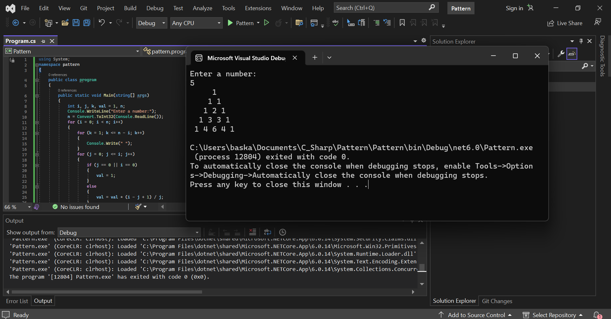

# Pattern

## AIM:
To write a C# program to print the pascal triangle.

## ALGORITHM:
Step 1:
Create a new Class named pascal.

Step 2:
Declare two variables of int data type one to store the input from user for no.of rows snd another the value for printing.

Step 3:
Get the number of rows from the user.

Step 4:
Using for loop print the rows and columns and space.

Step 5:
Check the first and last rows of the triange is 1 using if condition.

Step 6:
Otherwise use else to print the inner value val = val * (i - j + 1) / j

Step 7:
Print the program.

Step 8:
End of the Program.

## PROGRAM:
```
/*
Developed by : Paarkavy B
Register number : 212221230072
*/
```

```
using System;
namespace pattern
{
    public class program
    {
        public static void Main(string[] args)
        {
            int i, j, k, val = 1, n;
            Console.WriteLine("Enter a number:");
            n = Convert.ToInt32(Console.ReadLine());
            for (i = 0; i < n; i++)
            {
                for (k = 1; k <= n - i; k++)
                {
                    Console.Write(" ");
                }
                for (j = 0; j <= i; j++)
                {
                    if (j == 0 || i == 0)
                    {
                        val = 1;
                    }
                    else
                    {
                        val = val * (i - j + 1) / j;
                    }
                    Console.Write(val + " ");
                }
                Console.WriteLine();
            }
        }
    }
}
```
## OUTPUT:


## RESULT:
Thus, a C# program to display a Pascal triangle pattern is executed successfully.